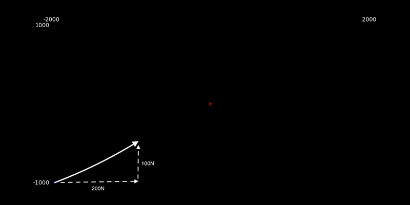

### Orbital Dynamics

A web app that allows you to input thrust forces and thrust duration for a spacecraft in orbit and see its trajectory animated relative to a target object; returning the amount of fuel used and closest distance to the target.

Originally starting as a University project to calculate the trajectories of spacecraft to intercept debris, I decided to evolve the Python scripts into a Web App to provide a fun and visual user experience.

Variable names are designed to mirror their mathematical notation so for a more in depth explanation and derivation please see [OrbitalDynamicsEssay.pdf](./OrbitalDynamicsEssay.pdf).

### Goal

The goal is to fire your spacecraft's thrusters to intercept a target in orbit using the least amount of fuel possible.

Adjust your starting position relative to the target and enter your thrust values in the horizontal direction (Fθ), vertical direction (Fr), and the duration for which you fire your thrusters (t).

The time and distance of your closest approach (tmin, dmin) will be calculated for you, along with the total fuel used in KG.

It is not as simple as firing directly at the target! Due to the nature of orbital dynamics, as your velocity in orbit increases, by definition your altitude also increases, so you end up behind/above the target, as demonstrated below:

